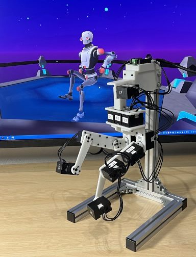
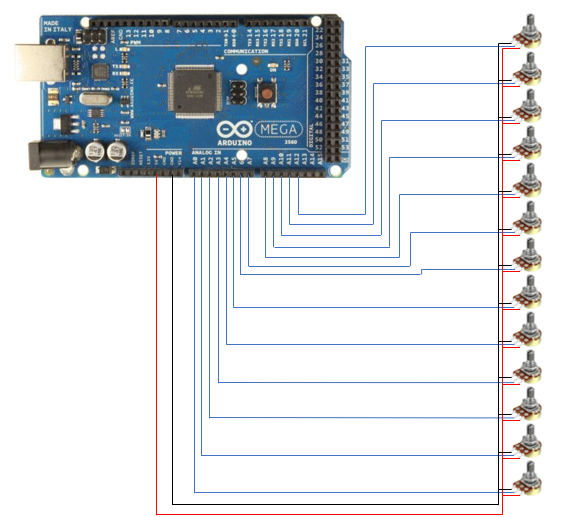
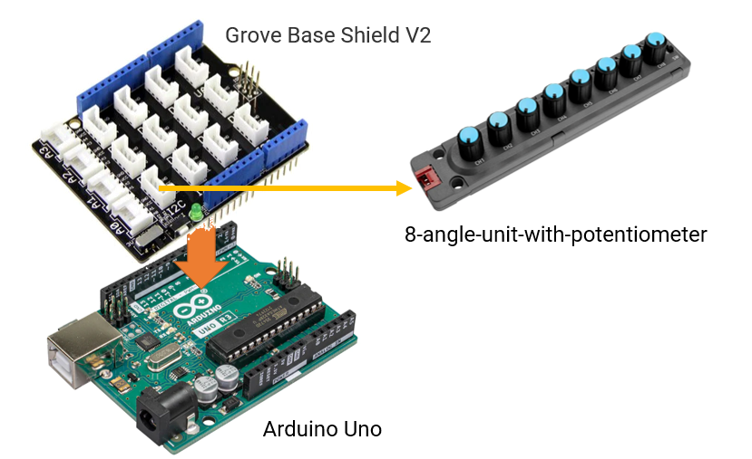

# damitora_external_connection

仮想トラッカーの制御ソフトウェア「だみとら２」の、外部接続機器を制作する際の技術資料と、サンプルのソースコードのリポジトリです。

「だみとら２」はこちらで公開しております。  
https://ddrive.booth.pm/items/3821909  

ROS版だみとら２は、こちらで公開しております。  
https://github.com/dreamdrive/ros_damitora  

# だみとらの外部接続

現在、だみとら2の外部接続は、2種類があります。

1. Dynamixel Input
2. Arduino Input

その他、BLEによる接続と、UDP/IPを使ったMeridianプロトコルでの外部接続を検討中です。


# Dynamixel Input (だみとら物理コントローラー)について

ROBOTIS社のDynamixel Xシリーズを入力デバイスとして使用するモードです。  
13個のDynamixelの通信レートを1Mbpsに設定し、IDを2～14に設定します。  
U2D2もしくは、OpenRB-150を経由して、PCを接続します。U2D2の場合は、Dynamixelに電源を供給する回路を作る必要があります。  OpenRB-150とXL330の組み合わせの場合は、USBのバスパワーで動作出来ますので便利です。

|  Dynamixel ID  |  関節  | だみとら2 スライダ |
| ---- | ---- | ---- |
|  2  |  首 仮想ジョイント ロール軸 | 該当なし ※1 |
|  3  |  首 仮想ジョイント ピッチ軸 | 該当なし ※1 |
|  4  |  首 仮想ジョイント ヨー軸 | 該当なし ※1 |
|  5  |  右脚ヨー軸  | 4番スライダ |
|  6  |  右脚ロール軸  | 5番スライダ |
|  7  |  右脚ピッチ軸  | 6番スライダ |
|  8  |  右膝ピッチ軸  | 7番スライダ |
|  9  |  左脚ヨー軸 | 9番スライダ |
|  10  |  左脚ロール軸  | 10番スライダ |
|  11  |  左脚ピッチ軸  | 11番スライダ |
|  12  |  左膝ピッチ軸  | 12番スライダ |
|  13  |  右足首ピッチ軸 ※2 | 8番スライダ |
|  14  |  左足首ピッチ軸 ※2 | 13番スライダ |

※1 "だみとら2"と物理コントローラーの間で、首のみ軸配置(軸の接続順)が違うため、だみとら物理コントローラーの軸配置にしたがって、だみとら側の首軸(ヨー・ロール・ピッチ)は、オイラー角を再計算して、動作します。

※2 足首軸は後から追加したため(VRCのIK2.0導入時)、IDが変則的になっています。

これを使った作例として、だみとら物理コントローラーがあります。(下記画像)

  

こちらの、3D形状データをMITライセンスで公開します。[3Dデータはこちら](./damicon/print/)  
組み立てに関しては、近日中に資料を整備します。


# Arduino Input について

## シリアル通信のプロトコルについて

シリアル通信は、下記の設定になります。

|  設定項目 |  パラメータ |
| ---- | ---- |
|  ボーレート  | 115,200bps |
|  データ  | 8ビット |
|  パリティ・ビット  | なし |
|  ストップ・ビット  | 1 |

送信内容は、下記の通りで、バイナリではなく文字列をそのまま送っております。

```
 [数値1,数値2,数値3,数値4,数値5,数値6,数値7,数値8,数値9,数値10,数値11,数値12,数値13]
```
1. 先頭に"["、最後に"]"が付きます、数値はカンマ区切りです。
2. 1つのデータをまとまりごとに、改行コードが入ります。
3. 数値は、角度 -180.0～180.0degを、10倍した符号付きの整数、-1800～1800になります。


## Arduinoのサンプルスケッチ１ (Sample 1)

### 概要

Arduino Megaに、13個のポテンショメーターを使用して だみとら2 の入力装置を自作するサンプルスケッチ

### サンプルスケッチ

[Sample01のスケッチはこちら](./arduino/sample_01/sample_01.ino)  

### 接続図

  


|  Arduino PIN  |  軸  | だみとら2 スライダ |
| ---- | ---- | ---- |
|  A0  |  首 ヨー軸 | 1番スライダ |
|  A1  |  首 ロール軸  | 2番スライダ |
|  A2  |  首 ピッチ軸  | 3番スライダ |
|  A3  |  右脚ヨー軸  | 4番スライダ |
|  A4  |  右脚ロール軸  | 5番スライダ |
|  A5  |  右脚ピッチ軸  | 6番スライダ |
|  A6  |  右膝ピッチ軸  | 7番スライダ |
|  A7  |  右足首ピッチ軸 | 8番スライダ |
|  A8  |  左脚ヨー軸  | 9番スライダ |
|  A9  |  左脚ロール軸  | 10番スライダ |
|  A10  |  左脚ピッチ軸  | 11番スライダ |
|  A11  |  左膝ピッチ軸  | 12番スライダ |
|  A12  |  左足首ピッチ軸 | 13番スライダ |


## Arduinoのサンプルスケッチ２ (Sample 2)

### 概要

M5Stack 8Angle Potentiometer Unit を使用して だみとら2 の入力装置を自作するサンプルスケッチ

### サンプルスケッチ

[Sample0２のスケッチはこちら](./arduino/sample_02/sample_02.ino)  

### 接続図


  


## 履歴
* 2023/02/05 :  とりあえず公開

## Author

* みっちー @ Dream Drive !!
  * [https://dream-drive.net/](https://dream-drive.net/)

## License

This is under [MIT LICENSE](./LICENSE).

